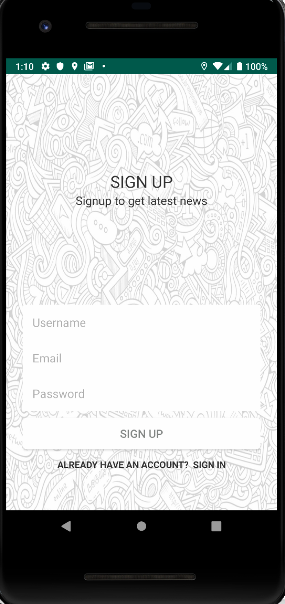

# NewsFeedAndroidApp

An Android app which curates news from multiple news portal using NEWS API and displays news as per your preference and location. In this app.

### Features

1. News from different sources.
2. Location Listener to fetch user's location and displays news accordingly
3. Feature to share news on different social media channels
4. Upvote news
5. Short, Precise news in less than 100 words. For more details article it will redirect to the full article to the browser.

### News Feed Screenshot

 

